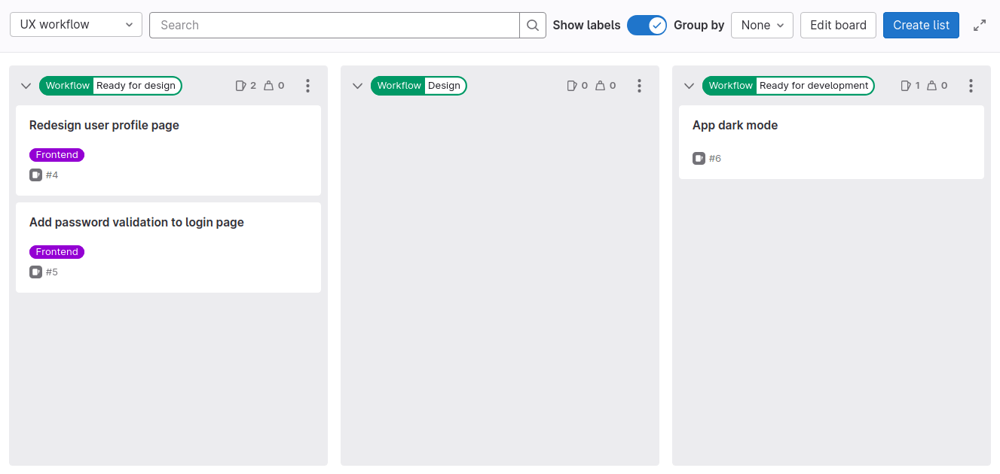
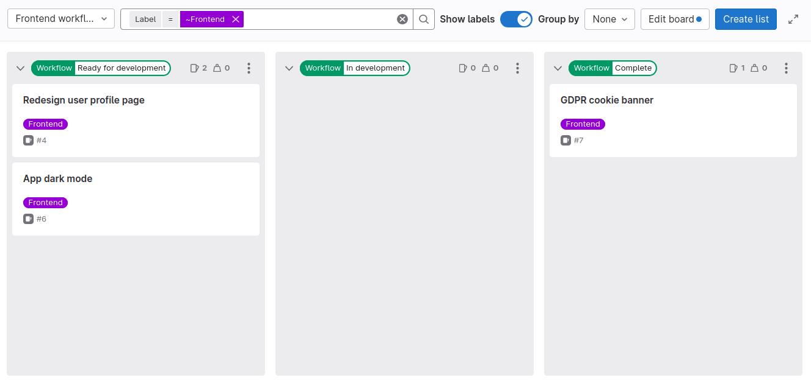
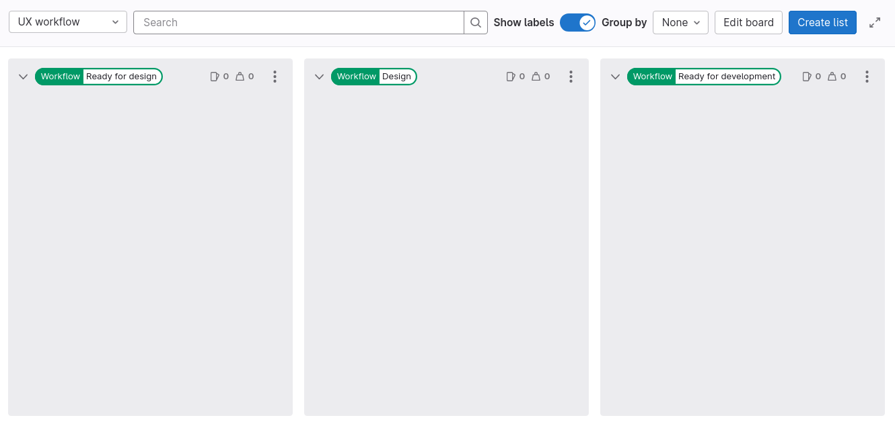
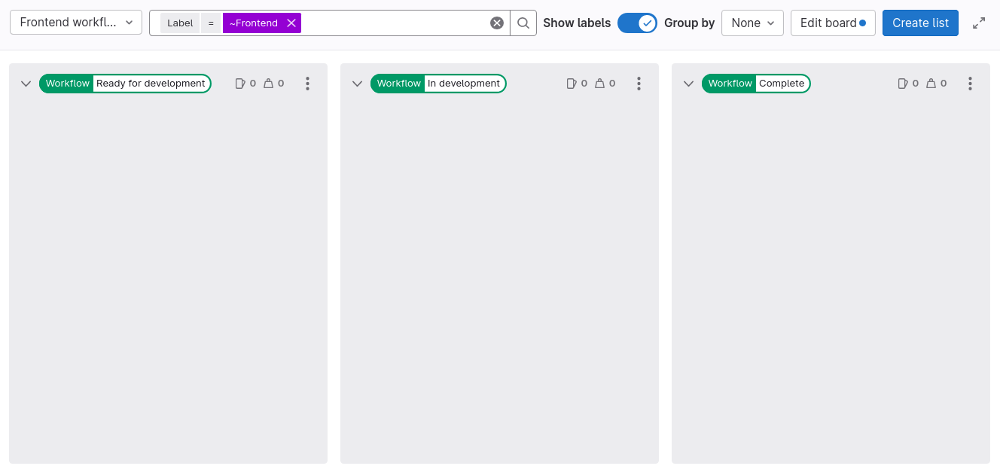

# Tutorial: Set up issue boards for team hand-off **(PREMIUM ALL)**

<!-- vale gitlab.FutureTense = NO -->

This tutorial shows you how to set up [issue boards](../../user/project/issue_board.md) and [scoped labels](../../user/project/labels.md#scoped-labels) for two teams that work on issues in sequence.

In this example, you'll create two issue boards for the UX and Frontend teams.
Using the following steps, you can create issue boards and workflows for more sub-teams, like Backend
or Quality Assurance.
To learn how we use workflow labels at GitLab, see [Product Development Flow](https://about.gitlab.com/handbook/product-development-flow).

To set up issue boards for multiple teams:

1. [Create a group](#create-a-group)
1. [Create a project](#create-a-project)
1. [Create labels](#create-labels)
1. [Create team issue boards](#create-team-issue-boards)
1. [Create issues for features](#create-issues-for-features)

## Before you begin

- If you're using an existing group for this tutorial, make sure you have at least the Reporter role for the group.
- If you're using an existing project for this tutorial, make sure you have at least the Reporter role for the project.

## The goal workflow

After you set up everything, the two teams will be able to hand off issues from one board to another, for example, like this:

1. The project lead adds the `Workflow::Ready for design` and `Frontend` labels to a feature issue called **Redesign user profile page**.
1. A product designer on the UX team:
   1. Checks the `Workflow::Ready for design` list on the **UX workflow** board and decides to work on the profile page redesign.

      

   1. Assigns themselves to the **Redesign user profile page** issue.
   1. Drags the issue card to the `Workflow::Design` list. The previous workflow label is automatically removed.
   1. Creates the ✨new designs✨.
   1. [Adds the designs to the issue](../../user/project/issues/design_management.md).
   1. Drags the issue card to the `Workflow::Ready for development` list, which adds this label and removes any other `Workflow::` label.
   1. Unassigns themselves from the issue.
1. A developer on the Frontend team:
   1. Checks the `Workflow::Ready for development` list on the **Frontend workflow** board and chooses an issue to work on.

      

   1. Assigns themselves to the **Redesign user profile page** issue.
   1. Drags the issue card to the `Workflow::In development` list. The previous workflow label is automatically removed.
   1. Adds the frontend code in a [merge request](../../user/project/merge_requests/index.md).
   1. Adds the `Workflow::Complete` label.

## Create a group

To prepare for when your project grows, start by creating a group.
You use groups to manage one or more related projects at the same time.
You add your users as members in the group, and assign them a role.

To create a group:

1. On the left sidebar, at the top, select **Create new** (**{plus}**) and **New group**.
1. Select **Create group**.
1. Complete the fields. Name your group `Paperclip Software Factory`.
1. Select **Create group**.

You've created an empty group. Next, you'll create a project that will store your issues and code.

## Create a project

The main code development work happens in projects and their repositories.
A project contains your code and pipelines, but also the issues that are used for planning your
upcoming code changes.

To create a blank project:

1. In your group, on the left sidebar, at the top, select **Create new** (**{plus}**) and then select
   **In this group > New project/repository**.
1. Select **Create blank project**.
1. Enter the project details:
   - In the **Project name** field, name your project `Paperclip Assistant`.
1. Select **Create project**.

## Create labels

You need a team label and a set of workflow labels to show where in the development cycle an issue is.

You could create these labels in your `Paperclip Assistant` project, but it's better to create them
in the `Paperclip Software Factory` group. This way, these labels will also be available in all the other
projects you create later.

To create each label:

1. On the left sidebar, select **Search or go to** and find your **Paperclip Software Factory** group.
1. Select **Manage > Labels**.
1. Select **New label**.
1. In the **Title** field, enter the name of the label. Start with `Frontend`.
1. Optional. Select a color by selecting from the available colors, or enter a hex color value for
   a specific color in the **Background color** field.
1. Select **Create label**.

Repeat these steps to create all the labels you'll need:

- `Frontend`
- `Workflow::Ready for design`
- `Workflow::Design`
- `Workflow::Ready for development`
- `Workflow::In development`
- `Workflow::Complete`

## Create team issue boards

Like with labels, you could create your issue boards in the **Paperclip Assistant** project,
but it can be better to have them in the **Paperclip Software Factory** group. This way, you'll be able
to manage issues from all the projects that you might create later in this group.

To create a new group issue board:

1. On the left sidebar, select **Search or go to** and find your **Paperclip Software Factory** group.
1. Select **Plan > Issue boards**.
1. Create the UX workflow and Frontend workflow boards.

To create the **UX workflow** issue board:

1. In the upper-left corner of the issue board page, select the dropdown list with the current board name.
1. Select **Create new board**.
1. In the **Title field**, enter `UX workflow`.
1. Clear the **Show the Open list** and **Show the Closed list** checkboxes.
1. Select **Create board**. You should see an empty board.
1. Create a list for the `Workflow::Ready for design` label:
   1. In the upper-left corner of the issue board page, select **Create list**.
   1. In the column that appears, from the **Value** dropdown list, select the `Workflow::Ready for design` label.
   1. Select **Add to board**.
1. Repeat the previous step for labels `Workflow::Design` and `Workflow::Ready for development`.

To create the **Frontend workflow** board:

1. In the upper-left corner of the issue board page, select the dropdown list with the current board name.
1. Select **Create new board**.
1. In the **Title field**, enter `Frontend workflow`.
1. Clear the **Show the Open list** and **Show the Closed list** checkboxes.
1. Expand **Scope**.
1. Next to **Labels**, select **Edit** and select the `Frontend` label.
1. Select **Create board**.
1. Create a list for the `Workflow::Ready for development` label:
   1. In the upper-left corner of the issue board page, select **Create list**.
   1. In the column that appeared, from the **Value** dropdown list, select the `Workflow::Ready for development` label.
   1. Select **Add to board**.
1. Repeat the previous step for labels `Workflow::In development` and `Workflow::Complete`.

For now, lists in both your boards should be empty. Next, you'll populate them with some issues.

## Create issues for features

To track upcoming features, enhancements, and bugs, you must create some issues.
Issues belong in projects, but you can also create them directly from your issue board.

To create an issue from your board:

1. In the upper-left corner of the issue board page, select the dropdown list with the current board name.
1. Select **UX workflow**.
1. On the `Workflow::Ready for development` list, select **Create new issue** (**{plus}**).
1. Complete the fields:
   1. Under **Title**, enter `Redesign user profile page`.
   1. Under **Projects**, select **Paperclip Software Factory / Paperclip Assistant**.
1. Select **Create issue**. Because you created the new issue in the label list, it gets created
   with this label.
1. Add the `Frontend` label, because only issues with this label appear on the Frontend team's board:
   1. Select the issue card (not its title), and a sidebar appears on the right.
   1. In the **Labels** section of the sidebar, select **Edit**.
   1. From the **Assign labels** dropdown list, select the `Workflow::Ready for design` and
      `Frontend` labels. The selected labels are marked with a checkmark.
   1. To apply your changes to labels, select **X** next to **Assign labels** or select any area
      outside the label section.

Repeat these steps to create a few more issues with the same labels.

You should now see at least one issue there, ready for your product designers to start working on!

Congratulations! Now your teams can start collaborating on amazing software.
As a next step, you can try out [the goal workflow](#the-goal-workflow) for yourself using these boards,
simulating the two teams interacting.

## Learn more about project management in GitLab

Find other tutorials about project management on the [tutorials page](../plan_and_track.md).
